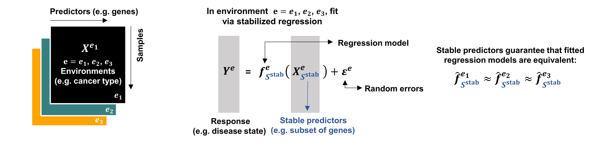

# StableMate
StableMate [(Deng et al.2023)](https://www.biorxiv.org/content/10.1101/2023.09.26.559658v1) is a regression and variable selection framework in a multi-environment regression setting. Given a response, StableMate distinguish between stable and unstable predictors that have consistent or changing functional dependencies (e.g, fitted regression models) on the response across environments, respectively. Stable predictors entile strong causal implication and can be selected to enforce generalizability of regression models. Unstable predictors (which we refered to as environment-specific predictors in our manuscript) reveals the impact of environment pertubation on the studied system of predictors and response.

StableMate is built based on the theoretical foundation of **Stabilized Regression** [(Pfister et al. 2021)](https://arxiv.org/abs/1911.01850), but implements a different algorithm, **Stochastic Stepwise Variable Selection (ST2)** [(Xin et al. 2012)](https://www.tandfonline.com/doi/abs/10.1080/10618600.2012.679223), to discern stability, since the original algorithm is slow and inacurrate when applied to large scale data. We made further modification on the ST2 algorithm to improve computational efficiency, and proposed a new statistical concept called **pseudo-predictor** that adds on intuitive and accurate benchmark of ST2 selections. 



## StableMate analysis
Go to the [analysis](./analysis) folder for the code and data used in [Deng et al. (2023)](https://www.biorxiv.org/content/10.1101/2023.09.26.559658v1). 

## StableMate package
We provide the source code of all StableMate functions, along with a detailed vigenette, in the [pkg](./pkg) folder. 

## Installation
Install from github
``` r
devtools::install_github('meiosis97/StableMate@main',subdir = 'pkg')
```

## Usage
More details can be found in the [pkg](./pkg) folder.
Run StableMate regression
``` r
#' @param Y A response vector or matrix depending on the objective function. It should be a vector if the function is used with
#' StableMate's default objective.
#' @param X A predictor matrix with rows representing samples and columns representing predictors. The columns must be named.
#' @param env A character vector indicates sample environments. Should be of the same length as the number of rows of \code{X}.
#' @param ncore Numerical; Numerical; If greater than 0. Parallel computing is enabled.
mod_stbm <- stablemate(Y = y, X = X, env = env, K =100, ncore = 5, verbose = F)
```
Print StableMate regression
``` r
mod_stbm
```
Plot StableMate regression
``` r
plot(mod_stbm)
```
Predict by StableMate regression
``` r
predict(mod_stbm,  X = X)
```


## Reference
Deng, Y., Mao, J., Choi, J., & Le Cao, K. A. (2023). StableMate: a new statistical method to select stable predictors in omics data. bioRxiv, 2023-09.

Pfister, N., Williams, E. G., Peters, J., Aebersold, R., & Bühlmann, P. (2021). Stabilizing variable selection and regression. The Annals of Applied Statistics, 15(3), 1220-1246.

Xin, L., & Zhu, M. (2012). Stochastic stepwise ensembles for variable selection. Journal of Computational and Graphical Statistics, 21(2), 275-294.
