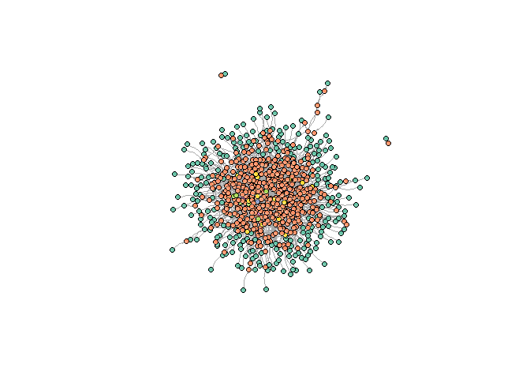
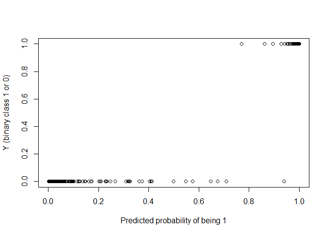

A introduction to StableMate (developing version)
================

## Before we start

Please be noted that this is an instruction of using StableMate by
sourcing a R script, which contains all the StableMate functions but is
not a proper R package. Sourcing a R script will load all the functions
in the script to the R global environment, and this could overwrite the
variables that are already defined in the global environment (if any
variable shares the same name as our functions). However, we created
comprehensive names for our functions and so it’s not likely that such
overwriting will happen.

The proper R package is under development, and it will be released soon.
**But we expect that what we documented here should also work easy and
well :)**

## Setup

StableMate depends on the following R packages, which need to be
installed if it’s not done yet (The following chunk of code will check
which required packages were not installed and automatically install
them for you).

``` r
# Packages needs to be installed
required_pkgs <- c('Matrix', 'dplyr', 'doParallel', 'doMPI',
                    'ggplot2', 'reshape2', 'ggrepel', 'MASS', 'progress', 'arm')
to_install <- required_pkgs[!required_pkgs %in% installed.packages()[,1]]
install.packages(to_install)
```

StableMate requires loading the R package *Matrix* to the global
environment.

``` r
library(Matrix)
```

As said before, we need to source the StableMate functions and load them
to the global environment.

``` r
# Put your own working directory that contains stablemate_pkg.R here
# setwd("C:/Users/Administrator/Desktop/gihub")
source("./stablemate_pkg.R")
```

Now we are ready to go\!

## Simulate data (just for demonstration purpose)

We demonstrate the usage of StableMate using simulated datasets. **So
this section is not necessary if you have your own data**. We simulate
data based on linear [structural causal
models](\\https://projecteuclid.org/journals/statistics-surveys/volume-3/issue-none/Causal-inference-in-statistics-An-overview/10.1214/09-SS057.full).
Our simulation method is detailed in [our
manuscript](https://www.biorxiv.org/content/10.1101/2023.09.26.559658v1.full)
(Supplementary Method 7.2).

Here we simulate systems of one response, 49 predictors under four
environments. Each environment contains 300 samples.

``` r
source("./simulation.R")
sim_out <- sim_scm()
```

<!-- -->

``` r
str(sim_out)
```

    ## List of 8
    ##  $ trainX: num [1:900, 1:49] 11.2 10.2 10.3 10.6 10.5 ...
    ##   ..- attr(*, "dimnames")=List of 2
    ##   .. ..$ : NULL
    ##   .. ..$ : chr [1:49] "X31" "X32" "X33" "X34" ...
    ##  $ trainY: num [1:900] 1.1 1.32 1.57 2.61 3.66 ...
    ##  $ testX : num [1:300, 1:49] -12.7 -12.2 -12.2 -12.9 -13.3 ...
    ##   ..- attr(*, "dimnames")=List of 2
    ##   .. ..$ : NULL
    ##   .. ..$ : chr [1:49] "X31" "X32" "X33" "X34" ...
    ##  $ testY : num [1:300] 9.11 9.58 9.99 10.78 8.74 ...
    ##  $ envs  : Factor w/ 3 levels "e1","e2","e3": 1 1 1 1 1 1 1 1 1 1 ...
    ##  $ idxMb : int [1:20] 32 47 67 69 73 76 79 37 45 46 ...
    ##  $ idxSb : int [1:10] 32 47 67 69 37 45 46 65 35 38
    ##  $ idxNsb: int [1:10] 73 76 79 42 56 61 51 71 54 72

The first three environments were treated as training environments, and
the last environment was treated as the testing environment.

## Stochastic stepwise variable selection (ST2)

We start by introducing ST2, the algorithm on which variable selection
in StableMate is based. Given a response and a set of predictors, the
goal of ST2 is to find a subset of predictor to optimize a objective
function. ST2 is a stochastic algorithm that could make different
selections at its each run. Hence we run ST2 for multiple times to make
repeated selections and build a variable selection ensemble. A final
selection is made by aggregating repeated selections. See [our
anuscript](https://www.biorxiv.org/content/10.1101/2023.09.26.559658v1.full)
(Supplementary Method 7.1.4) for details.

### A test run of ST2

Lets try to run ST2 on the simulated data with our function *st2e*
(stands for stochastic stepwise variable selection). By default, the
objective of *st2e* is to select predictors to minimize Bayesian
information criteria of linear models, so the selected predictors are
considered as being most predictive. The objective of *st2e* can be
changed and be user-defined (We will discuss this later). On the testing
data, we run *st2e* with one liner to build a ensemble of size 100. The
larger the ensemble, the more certain we are at the final selection:

``` r
y <- sim_out$testY
X <- sim_out$testX
# Y: response
# X: predictor matrix
# K: the number of ST2 repetition (the ensemble size)
system.time(
  mod_st2e <- st2e(Y = y, X = X, K =100)
)
```

    ##    user  system elapsed 
    ##   11.70    0.08   11.79

Selection result is summarized by calling the resulting R object.

``` r
mod_st2e 
```

    ## ----------------------------------------------------
    ## Summary of the objective scores of selections in the ensemble:
    ##    Min. 1st Qu.  Median    Mean 3rd Qu.    Max. 
    ## -296.14 -277.05 -261.64 -251.64 -244.05  -10.62 
    ## ----------------------------------------------------
    ## Selections are made based on conditional importance scores 
    ## Predictors selected significantly more often than the pseudo-predictor are: 
    ## X32 X35 X38 X45 X46 X47 X65 X67 X72 X76 X79

In theory, the set of predictor that minimizes BIC is the Markov Blank
(MB) of the response. From the structural causal model we build, we know
which predictors are in MB, and we compare the these (true MB)
predictors with the st2e selection

    ## True MB:

    ##  [1] "X32" "X47" "X67" "X69" "X73" "X76" "X79" "X37" "X45" "X46" "X65" "X35"
    ## [13] "X38" "X42" "X56" "X61" "X51" "X71" "X54" "X72"

    ## Correctly selected:

    ##  [1] "X32" "X35" "X38" "X45" "X46" "X47" "X65" "X67" "X72" "X76" "X79"

    ## Falsely selected:

    ## character(0)

*st2e* did not make many selections due to a lack of repetition (small
\(K\)) and hence little confidence. The repetition can be increased in
practice. We can also visualize selections by

``` r
plot(mod_st2e) 
```

<!-- -->

The black dashed line is the selection importance score of the
pseudo-predictor. If a true predictor is selected more often than the
pseudo-predictor in a bootstrap procedure, we consider the true
predictor as being selected by *st2e*. Therefore, the importance score
of the pseudo-predictor can be intuitively (and roughly) thought of as a
significant threshold.

### Parallel computing

StableMate supports parallel computing in different types of system
environment. When you specify the *ncore* argument in *st2e*, parallel
computing will be enabled. **Note that: you should adjust the
*par\_method* argument in *st2e* according to your system to control the
parallel computing method to be used by *st2e***.

  - Set *par\_method* = “SNOW” for a WINDOWS machine
  - Set *par\_method* = “MC” for a non-windows machine (e.g, LINUX,
    macOS)
  - Set *par\_method* = “MPI” for clusters, or high performance
    computing.

Since this vignette is written on a WINDOWS PC, we just need to specific
*ncore*, whereas *par\_method* = “SNOW” is set as the default.

``` r
system.time(
  mod_st2e <- st2e(Y = y, X = X, K = 100, ncore = 5)
)
```

    ## discovered package(s): 
    ## automatically exporting the following variables from the local environment:
    ##   a, alpha, b, beta, do_rand_start, do_switch, ensemble, env, idx_chunk, lambda, max_size, new_obj_fun, obj_fun, one_st2e_itr, pred_pool, reg_fun, ret_mod, sel_fun, t, X, Y 
    ## explicitly exporting variables(s): rbeta_binom, dbeta_binom, st2_fwd, st2_bwd, st2_swt
    ## explicitly exporting package(s): Matrix
    ## numValues: 5, numResults: 0, stopped: TRUE
    ## got results for task 1
    ## numValues: 5, numResults: 1, stopped: TRUE
    ## returning status FALSE
    ## got results for task 2
    ## numValues: 5, numResults: 2, stopped: TRUE
    ## returning status FALSE
    ## got results for task 3
    ## numValues: 5, numResults: 3, stopped: TRUE
    ## returning status FALSE
    ## got results for task 4
    ## numValues: 5, numResults: 4, stopped: TRUE
    ## returning status FALSE
    ## got results for task 5
    ## numValues: 5, numResults: 5, stopped: TRUE
    ## calling combine function
    ## evaluating call object to combine results:
    ##   fun(accum, result.1, result.2, result.3, result.4, result.5)
    ## returning status TRUE

    ##    user  system elapsed 
    ##    2.97    0.04    7.61

Compared to *st2e* without parallel computing, the computational time
has been greatly reduced.

## StableMate

StableMate algorithm is based on ST2. StableMate repeat a ST2 procedure
that consists of two consecutive ST2 runs. StableMate first run ST2 to
select predictors that are most predictive (with a objective of
minimizing BIC of linear models by default). This is followed by a
second run of ST2 that selects stable predictors within the predictive
predictors just selected (with a objective of minimizing prediction sum
of squares of linear models by default). Therefore, StableMate builds
two ensembles, one with predictive selections and one with predictive
and stable selections. The later must be a subset of the former.

As stability is defined with respect to the environment from which data
are collected. Compared to *st2e*, the *stablemate* function requires a
additional environment variable indicting each sample’s environment (as
well as the objective for stability selections).

### A test run of StableMate

Now we run *stablemate* on the training data consisting of 900 samples
from three different environments. We directly enable parallel computing
to save some time (For details on how to tune parallel computing, refer
to the section [Parallel computing](#parallel-computing)).

``` r
y <- sim_out$trainY
X <- sim_out$trainX
env <- sim_out$envs
table(env)
```

    ## env
    ##  e1  e2  e3 
    ## 300 300 300

``` r
# Y: response
# X: predictor matrix
# K: the number of ST2 repetition (the ensemble size)
# env: environment variable
system.time(
  mod_stbm <- stablemate(Y = y, X = X, env = env, K =100, ncore = 5, verbose = F)
)
```

    ##    user  system elapsed 
    ##    6.25    0.20   22.10

Selection result is summarized again by calling the resulting R object.

``` r
mod_stbm 
```

    ## ----------------------------------------------------
    ## Summary of the objective scores of the selections in the prediction ensemble:
    ##    Min. 1st Qu.  Median    Mean 3rd Qu.    Max. 
    ##  -780.5  -757.0  -742.6  -736.3  -730.7  -551.7 
    ## ----------------------------------------------------
    ## Selections of predictive predictors are made based on joint importance scores 
    ## Predictors selected significantly more often than the pseudo-predictor in the predictivity selection are: 
    ## X32 X35 X38 X45 X46 X47 X51 X65 X67 X69 X71 X72 X76 X79 
    ## 
    ## ----------------------------------------------------
    ## Summary of the objective scores of the selections in the stable ensemble:
    ##    Min. 1st Qu.  Median    Mean 3rd Qu.    Max. 
    ##   48.56   82.17  100.95  163.89  158.14 2020.08 
    ## ----------------------------------------------------
    ## Selections of stale predictors are made based on conditional importance scores 
    ## Predictors selected as predictive and selected significantly more often than the pseudo-predictor in the stability selection are: 
    ## X32 X35 X38 X69 
    ## 
    ## Predictors selected as predictive and selected significantly less often than the pseudo-predictor in the stability selection are: 
    ## X79

And again we can visualize selections by

``` r
plot(mod_stbm) 
```

<!-- -->

The vertical dashed lines correspond to the (0.025, 0.975) bootstrap
quantile of the predictivity score (selection importance score in the
predictivity selection) of the pseudo-predictor. True predictors with
predictivity scores larger than the upper quantile are selected as
predictive and hence marked in the plot. Similarly, the horizontal
dashed lines corresponds to the bootstrap quantile of the stability
score of the pseudo-predictor. stability selection is done analogously.

Note that, the stability scores we show here are **conditional**: they
measure how stable predictors are conditioning on they are predictive.
We can also visualize how **predictive and stable** predictors are on
the y-axis by changing the *stab\_imp\_type* argument of *stablemate*

``` r
# stab_imp_type = 'conditional' by default
# Another option is 'joint'
plot(mod_stbm, stab_imp_type = 'joint') 
```

<!-- -->

These joint importance scores are better measurement of the overall
goodness of predictors in constructing prediction models.

## Make prediction with StableMate (or ST2)

*stablemate* (or *st2e*) fits a regression model (using linear
regression by default but can be other user defined regression methods),
based on each ST2 selection. Therefore, *stablemate* generates two
regression ensembles corresponding to its two variable selection
ensembles: one trained with predictive predictors and one trained with
predictive and stable predictors. We wrote a *predict* method for our
*stablemate* object class. By controlling the *assay* argument of the
*predict* function, we can choose which type of regression ensemble to
use for prediction. By default, prediction is made based on the
regression ensemble trained with predictive and stable predictors.

As a benchmark, we test prediction made by each type of ensemble as well
as by linear regression

``` r
testX <- sim_out$testX
testy <- sim_out$testY
# assay = 'stable_ensemble' by default
# Another option is 'prediction_ensemble'
Yhat_stab <- predict(mod_stbm, testX) 
# Predict based on the prediction ensemble without considering stability
Yhat_pred <- predict(mod_stbm, testX, assay = 'prediction_ensemble')
# linear regression
lm_mod <- lm(y~.,data.frame(X)) 
Yhat_ols <- predict(lm_mod, data.frame(testX))


plot(Yhat_stab, testy, xlab = 'Predicted', ylab = 'Y')
points(Yhat_pred, testy, col = 'blue')
points(Yhat_ols, testy, col = 'red')
abline(0,1,col = 'green')
legend(x = "bottomright",          
       legend = c("Stable ensemble", "Prediction ensemble", "OLS"),  
       fill = c('black','blue','red'),           
       cex = 1)                 
```

<!-- -->

Prediction made by the ensemble trained with predictive and stable
predictors (annotated as *Stable ensemble* in the plot) show least
deviance from the actual value of the response.

*st2e* object can also make prediction using the *predict* function.
*st2e* object only contains a single variable selection ensemble and
hence a single regression ensemble. Therefore, there is no option to
select which ensemble to predict.

``` r
# This chunk of code is not implemented, just for demonstration purpose
predict(mod_st2e, testX)
```

## Dealing with high dimensional data with pre-filtering

*st2e* also has an option to control the predictor pool of each ST2 run
that selects predictive predictors. The predictor pool restricts ST2 to
select only within the pool. This is useful when the predictor matrix
\(X\) is high-dimensional and we want to pre-filter predictors before
running *st2e*

Given that we want to build a ensemble of size \(K\) using *st2e*, we
can first implement the *lasso\_prefilt* function in our package to
pre-filter predictors by repeating a randomized lasso selection for
\(K\) times. Randomized lasso can make a different selection at each
time due to its stochasticity. We can then set, for each ST2 run in
*st2e*, a repeated selection made by the randomized lasso as its
predictor pool.

We test the usage of *lasso\_prefilt* with a larger simulated data set
containing 500 predictors

``` r
sim_out <- sim_scm(nNode = 500, nI = 250, propE = 0.01, idxY = 250)
```

<!-- -->

``` r
str(sim_out)
```

    ## List of 8
    ##  $ trainX: num [1:900, 1:499] 13 14.4 13.4 13 13.9 ...
    ##   ..- attr(*, "dimnames")=List of 2
    ##   .. ..$ : NULL
    ##   .. ..$ : chr [1:499] "X251" "X252" "X253" "X254" ...
    ##  $ trainY: num [1:900] -16.2 -18.4 -16.3 -16.6 -16.9 ...
    ##  $ testX : num [1:300, 1:499] -7.69 -9.51 -8.23 -8.38 -8.82 ...
    ##   ..- attr(*, "dimnames")=List of 2
    ##   .. ..$ : NULL
    ##   .. ..$ : chr [1:499] "X251" "X252" "X253" "X254" ...
    ##  $ testY : num [1:300] 10.5 11.9 10.1 10.9 11.8 ...
    ##  $ envs  : Factor w/ 3 levels "e1","e2","e3": 1 1 1 1 1 1 1 1 1 1 ...
    ##  $ idxMb : int [1:26] 251 271 591 660 663 697 710 282 444 550 ...
    ##  $ idxSb : int [1:11] 251 271 660 663 304 322 454 497 520 559 ...
    ##  $ idxNsb: int [1:15] 591 697 710 282 444 550 268 481 630 678 ...

We use *lasso\_prefilt* to repeat randomized lasso for 100 times, each
time make a selection of 50 predictors. Parallel computing is enabled,
and the usage is the same as described in [Parallel
computing](#parallel-computing).

``` r
y <- sim_out$trainY
X <- sim_out$trainX
env <- sim_out$envs
# Y: response
# X: predictor matrix
# K: the number of randomized lasso repetition, this should be your desired ensemble size of your stablemate model
# env: environment variable
# p: the number of predictors to select by each run of randomized lasso
system.time(
  pred_pool <- lasso_prefilt(Y = y, X = X, env = env, p = 50, K = 100, ncore = 5, verbose = F)
)
```

    ## Warning: <anonymous>: ... may be used in an incorrect context: 'glmnet::glmnet(X[idx, ], Y[idx], weights = w, ...)'

    ## Warning: <anonymous>: ... may be used in an incorrect context: 'glmnet::glmnet(X[idx, ], Y[idx], ...)'

    ##    user  system elapsed 
    ##    0.06    0.06    2.62

``` r
head(pred_pool)
```

    ## 6 x 22 Matrix of class "dgeMatrix"
    ##      pseudo_predictor X251 X268 X271 X295 X312 X405 X436 X559 X585 X598 X611
    ## [1,]                1    1    0    1    1    1    1    0    1    0    0    1
    ## [2,]                1    1    0    1    1    1    0    0    1    0    0    1
    ## [3,]                1    1    1    1    1    1    1    0    1    0    0    1
    ## [4,]                1    1    0    1    1    1    0    0    1    0    0    0
    ## [5,]                1    1    1    1    0    1    1    0    0    0    0    0
    ## [6,]                1    1    1    1    1    1    0    0    0    0    0    0
    ##      X637 X649 X651 X660 X677 X692 X710 X715 X733 X735
    ## [1,]    0    0    0    1    0    0    0    0    0    0
    ## [2,]    0    0    1    1    0    0    1    1    1    0
    ## [3,]    0    0    1    1    0    1    0    1    1    0
    ## [4,]    0    0    0    1    0    0    0    1    1    0
    ## [5,]    0    0    1    1    0    0    0    1    1    0
    ## [6,]    0    1    0    1    0    0    1    1    1    0

*lasso\_prefilt* will generate an indicator matrix with columns
representing predictors and each row corresponds to a selection result
in one run of randomized lasso (1 represents selected, 0 otherwise). Now
we can provide this indicator matrix to the *st2e* function.

``` r
# This chunk of code is not implemented, just for demonstration purpose.
# pred_pool: restricting the variable selection space of ST2. Can be a vector of predictor names, or an indicator matrix specifying the predictor pool of each ST2 selection across the size K ensemble.
mod_st2e <- st2e(Y = y, X = X, env = env, K = 100, ncore = 5, pred_pool = pred_pool)
```

*stablemate* runs *st2e* for two times, the first time selects
predictive predictors and the second time selects stable predictors
within the predictive predictors selected. Each of the two *st2e* run
can be controlled by users independently via the *pred\_st2\_ctrl* and
*stab\_st2\_ctrl* argument of *stablemate*. We define the predictor pool
of the first *st2e* in *stablemate* to pre-filter for *stablemate*:

``` r
# pred_st2_ctrl: a list used for specifying the control of ST2 in selecting predictive predictors. Available controls are the same as that of st2e function.
# stab_st2_ctrl: same as pred_st2_ctrl, but specifies the control of ST2 in selecting stable predictors.
system.time(
  mod_stbm <- stablemate(Y = y, X = X, env = env, K = 100, ncore = 5,
                         pred_st2_ctrl = list(pred_pool = pred_pool), verbose = F)
)
```

    ##    user  system elapsed 
    ##    5.85    0.14   10.96

*stablemate* achieves a similar running time as the previous test run on
the simulated data of 50 predictors.

## Customize your own ST2 algorithm

StableMate provides a computational framework that can be flexibly
customized for users’ specific regression and variable selection
problems. Our flexibility is achieved by allowing three functions in the
core of the *st2e* algorithm for users to define, while providing
defaults of the functions for immediate implementation.

These three functions are: 
- **Objective function**: the function that
calculates the objective score of a given set of variables. ST2 will
search for the set that minimize the objective score. In our testing
example [Stochastic stepwise variable selection
(ST2)](#stochastic-stepwise-variable-selection-st2), our default
objective function *obj\_bic* performs linear regression between
predictors and the response. Objective score is the BIC score of the
resulting model. *stablemate* also performs *st2e* for both stability
selection. The default objective function for stability selection is
*obj\_pss* that calculates prediction sum of squares (refer to
Supplementary Method 7.2 in [our
manuscript](https://www.biorxiv.org/content/10.1101/2023.09.26.559658v1.full)
for details.

The following two functions are not necessary if the goal
is not to make new predictions.

- **Regression function**: the function
that builds regression model given a set of selected predictors. In our
testing example, our default regression function *reg\_ols* is linear
regression, which returns regression coefficients \(\hat{\beta}\).
- **Prediction function**: the function that makes prediction given data
and a regression model build with the defined regression function. In
our testing example, our default prediction function *pred\_ols*
performs matrix multiplication \(\hat{Y} = X\hat{\beta}\).

Here we do not elaborate on how these functions are defined (but it will
be done in the future). However, we believe that an experienced R user
will face no difficulty in defining these functions if they can read the
code of our default functions.

Other than the defaults, we also provide alternative functions
*obj\_bic\_logit*, *reg\_logit* and *pred\_logit* for logistic
regression and binary classification. We show how to run ST2 with these
alternative functions in the following chunk of code. We first convert
the continuous response we previously simulated in [Dealing with high
dimensional data with
pre-filtering](#dealing-with-high-dimensional-data-with-pre-filtering)
to a binary response.

``` r
y <- sim_out$trainY
y <- exp(y)/(1+exp(y))
y <- as.numeric(runif(length(y)) > y)
```

Lasso pre-filtering is then applied.

``` r
# Any argument of the glmnet function can be passed to lasso_prefilt. Here we specify the distribution family of the response by setting family = 'binomial', which tells glmnet to perform binomial regression for binary classification. 
system.time(
  pred_pool <- lasso_prefilt(Y = y, X = X, env = env, p = 50, K = 100, ncore = 5, verbose = F,
                             family = 'binomial', group = 'Yenv')
)
```

    ##    user  system elapsed 
    ##    0.02    0.08    3.75

We run *st2e* to select within the pre-filtered predictors of randomized
lasso (i.e, *pred\_pool*), and use *obj\_bic\_logit* to calculate
objective scores, use *reg\_logit* to build regression models.

``` r
# This chunk of code is not implemented, just for demonstration purpose.
# reg_fun: the regression function fitted on selected predictors.
# obj_fun: the objective function of variable selection.
mod_st2e <- st2e(Y = y, X = X, env = env, K = 100, ncore = 5, 
                 reg_fun = reg_logit, obj_fun = obj_bic_logit, pred_pool = pred_pool)
```

*stablemate* can be implemented with customized objective function and
regression function by controlling its internal *st2e* runs as what we
done in [Dealing with high dimensional data with
pre-filtering](#dealing-with-high-dimensional-data-with-pre-filtering).
We provide an alternative objective function *obj\_pss\_logit* to select
stable predictors for logistic regression.

``` r
system.time(
  mod_stbm <- stablemate(Y = y, X = X, env = env, K = 100, ncore = 5,
                         pred_st2_ctrl = list(reg_fun = reg_logit, obj_fun = obj_bic_logit,
                                              pred_pool = pred_pool),
                         stab_st2_ctrl = list(reg_fun = reg_logit, obj_fun = obj_pss_logit),
                         verbose = F)
)
```

    ##    user  system elapsed 
    ##    6.87    0.08   88.93

To make prediction based on logistic models trained in *stablemate*,
we also use the *predict* function defined for the *stablemate* object
class, but we need to provide the alternative prediction function
*pred\_logit* to define how does logistic model make prediction.

``` r
# pred_fun: the function that makes prediction given data and a trained regression model.
Yhat_stab <- predict(mod_stbm, X, pred_fun = pred_logit) 
plot(Yhat_stab, y, xlab = 'Predicted probability of being 1', ylab = 'Y (binary class 1 or 0)')
```

<!-- -->
