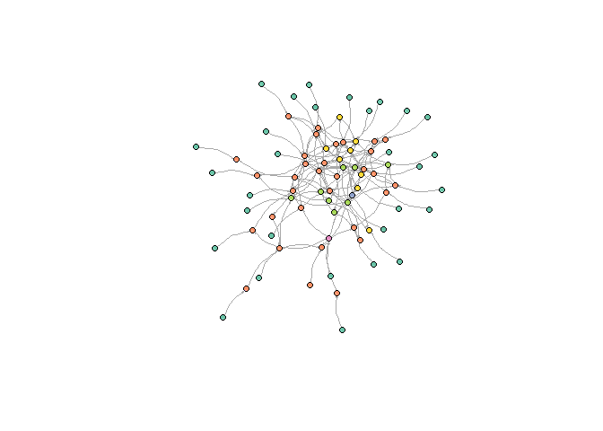
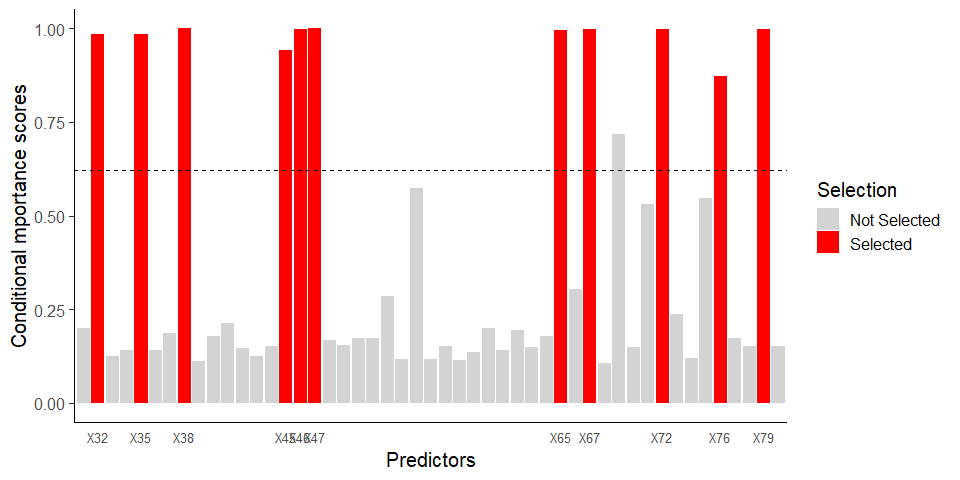
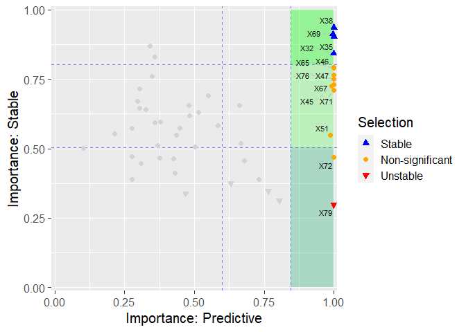
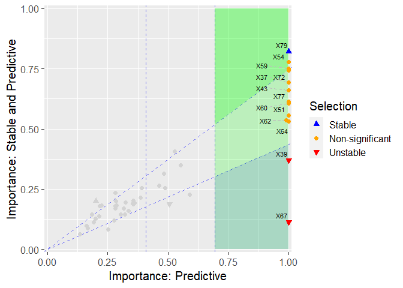
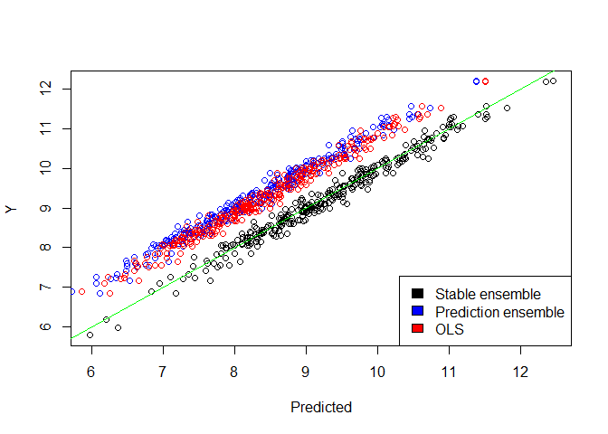

A introduction to StableMate (developing version)
================

## Before we start

Please be noted that this is an instruction of using StableMate by
sourcing a R script, which contains all the StableMate functionality but
is not a proper R package. Sourcing a R script will load all the
functions in the script to the R global environment, and this could
overwrite the variables that are already defined in the global
environment (if any variable shares the same name as our functions).
However, we created comprehensive names for our functions and so it’s
not likely that overwriting will happen.

The proper R package is under development, and it will be released soon.
**But we expect that what we documented here should also work easy and
well :)**

## Setup

StableMate depends on the following R packages, which need to be
installed if it’s not done yet (The following chunk of code will check
which required packages were not installed and automatically install
them for you).

``` r
# Packages needs to be installed
required_pkgs <- c('Matrix', 'dplyr', 'doParallel', 'doMPI',
                    'ggplot2', 'reshape2', 'ggrepel', 'MASS', 'progress', 'arm')
to_install <- required_pkgs[!required_pkgs %in% installed.packages()[,1]]
install.packages(to_install)
```

StableMate requires loading the R package *Matrix* to the global
environment.

``` r
library(Matrix)
```

As said before, we need to source the StableMate functions and load them
to the global environment.

``` r
# Put your own working directory that contains stablemate_pkg.R here
# setwd("C:/Users/Administrator/Desktop/gihub")
source("./stablemate_pkg.R")
```

Now we are ready to go\!

## Simulate data (just for demonstration purpose)

We demonstrate the usage of StableMate using simulated datasets. **So
this section is not necessary if you have your own data**. We simulate
data based on linear [structural causal
models](\\https://projecteuclid.org/journals/statistics-surveys/volume-3/issue-none/Causal-inference-in-statistics-An-overview/10.1214/09-SS057.full).
Our simulation method is detailed in [our
manuscript](https://www.biorxiv.org/content/10.1101/2023.09.26.559658v1.full)
(Supplementary Method 7.2).

Here we simulate systems of one response, 49 predictors under four
environments. Each environment contains 300 samples.

``` r
source("./simulation.R")
sim_out <- sim_scm()
```

<!-- -->

``` r
str(sim_out)
```

    ## List of 8
    ##  $ trainX: num [1:900, 1:49] -0.643 -1.209 -0.839 -0.674 -0.942 ...
    ##   ..- attr(*, "dimnames")=List of 2
    ##   .. ..$ : NULL
    ##   .. ..$ : chr [1:49] "X31" "X32" "X33" "X34" ...
    ##  $ trainY: num [1:900] 5.74 5.64 6.59 6.61 5.89 ...
    ##  $ testX : num [1:300, 1:49] -0.778 -0.849 -0.481 -0.666 -0.659 ...
    ##   ..- attr(*, "dimnames")=List of 2
    ##   .. ..$ : NULL
    ##   .. ..$ : chr [1:49] "X31" "X32" "X33" "X34" ...
    ##  $ testY : num [1:300] -2.73 -2.78 -4.55 -3.12 -3.92 ...
    ##  $ envs  : Factor w/ 3 levels "e1","e2","e3": 1 1 1 1 1 1 1 1 1 1 ...
    ##  $ idxMb : int [1:17] 37 57 62 64 67 72 79 35 49 51 ...
    ##  $ idxSb : int [1:9] 37 57 72 35 49 51 45 54 59
    ##  $ idxNsb: int [1:8] 62 64 67 79 39 43 60 77

The first three environments were treated as training environments, and
the last environment was treated as the testing environment.

## Stochastic stepwise variable selection (ST2)

We start by introducing ST2, the algorithm on which variable selection
in StableMate is based. Given a response and a set of predictors, the
goal of ST2 is to find a subset of predictor to optimize a objective
function. ST2 is a stochastic algorithm that could make different
selections at its each run. Hence we run ST2 for multiple times to make
repeated selections and build a variable selection ensemble. A final
selection is made by aggregating repeated selections. See [our
anuscript](https://www.biorxiv.org/content/10.1101/2023.09.26.559658v1.full)
(Supplementary Method 7.1.4) for details.

### A test run of ST2

Lets try to run ST2 on the simulated data with our function *st2e*
(stands for stochastic stepwise variable selection). By default, the
objective of *st2e* is to select predictors to minimize Bayesian
information criteria of linear models, so the selected predictors are
considered as being most predictive. The objective of *st2e* can be
changed and be user-defined (We will discuss this later). On the testing
data, we run *st2e* with one liner to build a ensemble of size 100. The
larger the ensemble, the more certain we are at the final selection:

``` r
y <- sim_out$testY
X <- sim_out$testX
# Y: response
# X: predictor matrix
# K: the number of ST2 repetition (the ensemble size)
system.time(
  mod_st2e <- st2e(Y = y, X = X, K =100)
)
```

    ##    user  system elapsed 
    ##   11.25    0.06   11.34

Selection result is summarized by calling the resulting R object.

``` r
mod_st2e 
```

    ## ----------------------------------------------------
    ## Summary of the objective scores of selections in the ensemble:
    ##    Min. 1st Qu.  Median    Mean 3rd Qu.    Max. 
    ##  -324.2  -296.8  -279.6  -273.4  -261.9  -166.2 
    ## ----------------------------------------------------
    ## Selections are made based on conditional importance scores 
    ## Predictors selected significantly more often than the pseudo-predictor are: 
    ## X39 X43 X51 X54 X59 X60 X62 X64 X67 X72 X77 X79

In theory, the set of predictor that minimizes BIC is the Markov Blank
(MB) of the response. From the structural causal model we build, we know
which predictors are in MB, and we compare the these (true MB)
predictors with the st2e selection

    ## True MB:

    ##  [1] "X37" "X57" "X62" "X64" "X67" "X72" "X79" "X35" "X49" "X51" "X39" "X43"
    ## [13] "X60" "X45" "X54" "X59" "X77"

    ## Correctly selected:

    ##  [1] "X39" "X43" "X51" "X54" "X59" "X60" "X62" "X64" "X67" "X72" "X77" "X79"

    ## Falsely selected:

    ## character(0)

*st2e* did not make many selections due to a lack of repetition (small
\(K\)) and hence little confidence. The repetition can be increased in
practice. We can also visualize selections by

``` r
plot(mod_st2e) 
```

<!-- -->

The black dashed line is the selection importance score of the
pseudo-predictor. If a true predictor is selected more often than the
pseudo-predictor in a bootstrap procedure, we consider the true
predictor as being selected by *st2e*. Therefore, the importance score
of the pseudo-predictor can be intuitively (and roughly) thought of as a
significant threshold.

### Parallel computing

StableMate supports parallel computing in different types of system
environment. When you specify the *ncore* argument in *st2e*, parallel
computing will be enabled. **Note that: you should adjust the
*par\_method* argument in *st2e* according to your system to control the
parallel computing method to be used by *st2e***.

  - Set *par\_method* = “SNOW” for a WINDOWS machine
  - Set *par\_method* = “MC” for a non-windows machine (e.g, LINUX,
    macOS)
  - Set *par\_method* = “MPI” for clusters, or high performance
    computing.

Since this vignette is written on a WINDOWS PC, we just need to specific
*ncore*, whereas *par\_method* = “SNOW” is set as the default.

``` r
system.time(
  mod_st2e <- st2e(Y = y, X = X, K = 100, ncore = 5)
)
```

    ## discovered package(s): 
    ## automatically exporting the following variables from the local environment:
    ##   a, alpha, b, beta, do_rand_start, do_switch, ensemble, env, idx_chunk, lambda, max_size, new_obj_fun, obj_fun, one_st2e_itr, pred_pool, reg_fun, ret_mod, sel_fun, t, X, Y 
    ## explicitly exporting variables(s): rbeta_binom, dbeta_binom, st2_fwd, st2_bwd, st2_swt
    ## explicitly exporting package(s): Matrix
    ## numValues: 5, numResults: 0, stopped: TRUE
    ## got results for task 1
    ## numValues: 5, numResults: 1, stopped: TRUE
    ## returning status FALSE
    ## got results for task 2
    ## numValues: 5, numResults: 2, stopped: TRUE
    ## returning status FALSE
    ## got results for task 3
    ## numValues: 5, numResults: 3, stopped: TRUE
    ## returning status FALSE
    ## got results for task 4
    ## numValues: 5, numResults: 4, stopped: TRUE
    ## returning status FALSE
    ## got results for task 5
    ## numValues: 5, numResults: 5, stopped: TRUE
    ## calling combine function
    ## evaluating call object to combine results:
    ##   fun(accum, result.1, result.2, result.3, result.4, result.5)
    ## returning status TRUE

    ##    user  system elapsed 
    ##    3.05    0.09    8.98

Compared to *st2e* without parallel computing, the computational time
has been greatly reduced.

## StableMate

StableMate algorithm is based on ST2. StableMate repeat a ST2 procedure
that consists of two consecutive ST2 runs. StableMate first run ST2 to
select predictors that are most predictive (with a objective of
minimizing BIC of linear models by default). This is followed by a
second run of ST2 that selects stable predictors within the predictive
predictors just selected (with a objective of minimizing prediction sum
of squares of linear models by default). Therefore, StableMate builds
two ensembles, one with predictive selections and one with predictive
and stable selections. The later must be a subset of the former.

As stability is defined with respect to the environment from which data
are collected. Compared to *st2e*, the *stablemate* function requires a
additional environment variable indicting each sample’s environment (as
well as the objective for stability selections).

### A test run of StableMate

Now we run *stablemate* on the training data consisting of 900 samples
from three different environments. We directly enable parallel computing
to save some time (For details on how to tune parallel computing, refer
to the section [Parallel computing](#parallel-computing)).

``` r
y <- sim_out$trainY
X <- sim_out$trainX
env <- sim_out$envs
table(env)
```

    ## env
    ##  e1  e2  e3 
    ## 300 300 300

``` r
# Y: response
# X: predictor matrix
# K: the number of ST2 repetition (the ensemble size)
# env: environment variable
system.time(
  mod_stbm <- stablemate(Y = y, X = X, env = env, K =100, ncore = 5)
)
```

    ## discovered package(s): 
    ## automatically exporting the following variables from the local environment:
    ##   a, alpha, b, beta, do_rand_start, do_switch, ensemble, env, idx_chunk, lambda, max_size, new_obj_fun, obj_fun, one_st2e_itr, pred_pool, reg_fun, ret_mod, sel_fun, t, X, Y 
    ## explicitly exporting variables(s): rbeta_binom, dbeta_binom, st2_fwd, st2_bwd, st2_swt
    ## explicitly exporting package(s): Matrix
    ## numValues: 5, numResults: 0, stopped: TRUE
    ## got results for task 1
    ## numValues: 5, numResults: 1, stopped: TRUE
    ## returning status FALSE
    ## got results for task 2
    ## numValues: 5, numResults: 2, stopped: TRUE
    ## returning status FALSE
    ## got results for task 3
    ## numValues: 5, numResults: 3, stopped: TRUE
    ## returning status FALSE
    ## got results for task 4
    ## numValues: 5, numResults: 4, stopped: TRUE
    ## returning status FALSE
    ## got results for task 5
    ## numValues: 5, numResults: 5, stopped: TRUE
    ## calling combine function
    ## evaluating call object to combine results:
    ##   fun(accum, result.1, result.2, result.3, result.4, result.5)
    ## returning status TRUE
    ## discovered package(s): 
    ## automatically exporting the following variables from the local environment:
    ##   a, alpha, b, beta, do_rand_start, do_switch, ensemble, env, idx_chunk, lambda, max_size, new_obj_fun, obj_fun, one_st2e_itr, pred_pool, reg_fun, ret_mod, sel_fun, t, X, Y 
    ## explicitly exporting variables(s): rbeta_binom, dbeta_binom, st2_fwd, st2_bwd, st2_swt
    ## explicitly exporting package(s): Matrix
    ## numValues: 5, numResults: 0, stopped: TRUE
    ## got results for task 1
    ## numValues: 5, numResults: 1, stopped: TRUE
    ## returning status FALSE
    ## got results for task 2
    ## numValues: 5, numResults: 2, stopped: TRUE
    ## returning status FALSE
    ## got results for task 3
    ## numValues: 5, numResults: 3, stopped: TRUE
    ## returning status FALSE
    ## got results for task 4
    ## numValues: 5, numResults: 4, stopped: TRUE
    ## returning status FALSE
    ## got results for task 5
    ## numValues: 5, numResults: 5, stopped: TRUE
    ## calling combine function
    ## evaluating call object to combine results:
    ##   fun(accum, result.1, result.2, result.3, result.4, result.5)
    ## returning status TRUE

    ##    user  system elapsed 
    ##    6.96    0.14   25.66

Selection result is summarized again by calling the resulting R object.

``` r
mod_stbm 
```

    ## ----------------------------------------------------
    ## Summary of the objective scores of the selections in the prediction ensemble:
    ##    Min. 1st Qu.  Median    Mean 3rd Qu.    Max. 
    ##  -876.7  -854.8  -843.1  -834.3  -828.9  -469.8 
    ## ----------------------------------------------------
    ## Selections of predictive predictors are made based on marginal importance scores 
    ## Predictors selected significantly more often than the pseudo-predictor in the predictivity selection are: 
    ## X37 X39 X43 X51 X54 X59 X60 X62 X64 X67 X72 X77 X79 
    ## 
    ## ----------------------------------------------------
    ## Summary of the objective scores of the selections in the stable ensemble:
    ##     Min.  1st Qu.   Median     Mean  3rd Qu.     Max. 
    ##    60.31   130.96   222.76   524.66   442.70 12466.55 
    ## ----------------------------------------------------
    ## Selections of stale predictors are made based on conditional importance scores 
    ## Predictors selected as predictive and selected significantly more often than the pseudo-predictor in the stability selection are: 
    ## X79 
    ## 
    ## Predictors selected as predictive and selected significantly less often than the pseudo-predictor in the stability selection are: 
    ## X39 X67

And again we can visualize selections by

``` r
plot(mod_stbm) 
```

<!-- -->

The vertical dashed lines correspond to the (0.025, 0.975) bootstrap
quantile of the predictivity score (selection importance score in the
predictivity selection) of the pseudo-predictor. True predictors with
predictivity scores larger than the upper quantile are selected as
predictive and hence marked in the plot. Similarly, the horizontal
dashed lines corresponds to the bootstrap quantile of the stability
score of the psesudo-predictor. stability selection is done analogously.

Note that, the stability scores we show here are **conditional**: they
measure how stable predictors are conditioning on they are predictive.
We can also visualize how **predictive and stable** predictors are on
the y-axis by changing the *stab\_imp\_type* argument of *stablemate*

``` r
# stab_imp_type = 'conditional' by default
# Another option is 'marginal'
plot(mod_stbm, stab_imp_type = 'marginal') 
```

<!-- -->

These marginal importance scores are better measurement of the overall
goodness of predictors in constructing prediction models.

### Make prediction with StableMate

*stablemate* (or *st2e*) fits a regression model (using linear
regression by default but can be other user defined regression methods),
based on each ST2 selection. Therefore, *stablemate* generates two
regression ensembles corresponding to its two variable selection
ensembles: one trained with predictive predictors and one trained with
predictive and stable predictors. We wrote a *predict* method for our
*stablemate* object class. By controlling the *assay* argument of the
*predict* function, we can choose which type of regression ensemble to
use for prediction. By default, prediction is made based on the
regression ensemble trained with predictive and stable predictors.

As a benchmark, we test prediction made by each type of ensemble as well
as by linear regression

``` r
testX <- sim_out$testX
testy <- sim_out$testY
# assay = 'stable_ensemble' by default
# Another option is 'prediction_ensemble'
Yhat_stab <- predict(mod_stbm, testX) 
# Predict based on the prediction ensemble without considering stability
Yhat_pred <- predict(mod_stbm, testX,assay = 'prediction_ensemble')
# linear regression
lm_mod <- lm(y~.,data.frame(X)) 
Yhat_ols <- predict(lm_mod, data.frame(testX))


plot(Yhat_stab, testy, xlab = 'Predicted', ylab = 'Y')
points(Yhat_pred, testy, col = 'blue')
points(Yhat_ols, testy, col = 'red')
abline(0,1,col = 'green')
legend(x = "bottomright",          
       legend = c("Stable ensemble", "Prediction ensemble", "OLS"),  
       fill = c('black','blue','red'),           
       cex = 1)                 
```

<!-- -->
Prediction
made by the ensemble trained with predictive and stable predictors
(annotated as *Stable ensemble* in the plot) show least deviance from
the actual value of the response.
